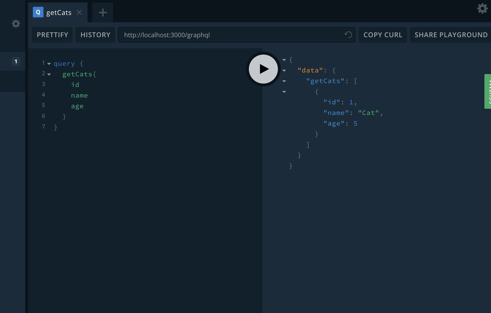

# nestjs graphql && docker demo

## How to Run (with docker-compose)

* build image

```code
docker-compose build
```

* Run

```code
docker-compose up -d

```

## How to Run (with local docker instance)

* build image

```code
docker build -t nest-graphql .
```

* Run

```code
docker run -d -p 3000:3000 nest-graphql

or with build image from dockerhub

docker run -d -p 3000:3000 dalongrong/nestjs-graphql

```

## with graphql playground


